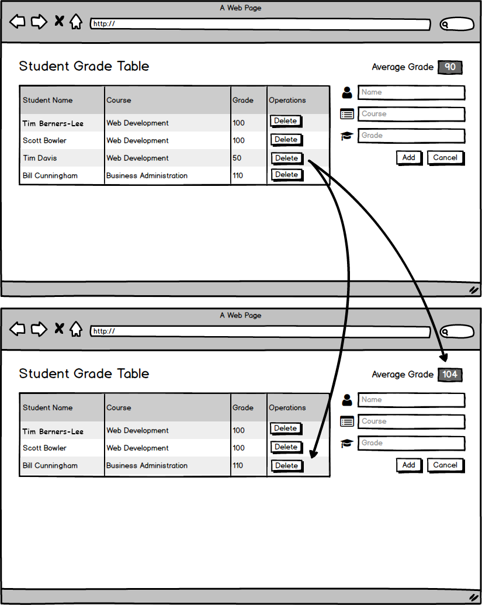
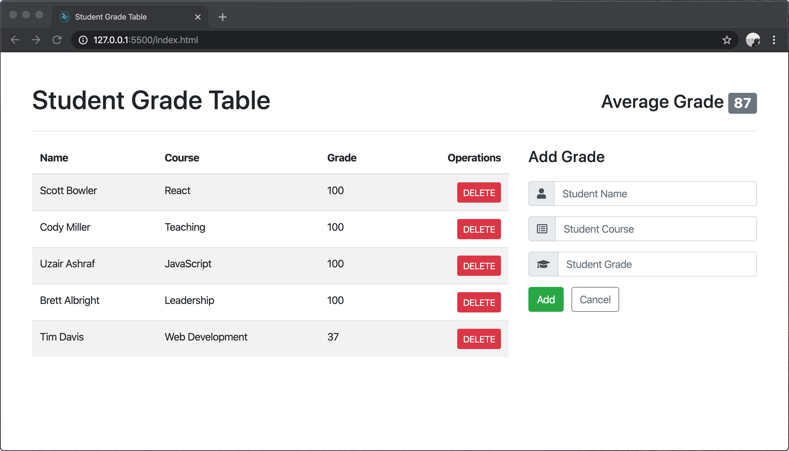

# User can add a grade.

## Before You Begin

Be sure to check out a new branch from your `master` branch. Your branch should be named `delete-a-grade` because that is the feature you are implementing.

## 💰 Motivation

Teachers at the school would like to record new student grades without having to give them to the database administrator.

## 🖼 Wireframe

  

## 👷‍♀ Implementation

**Make a commit after completing each of the following steps**. Your commit message should be a summary description of the code you wrote an why.

## ✅ Submitting Your Work

When this feature is complete, be sure to push all new commits to `origin delete-a-grade`. Then open a Pull Request on your `student-grade-table` GitHub repository to merge `delete-a-grade` into `master`.

Get an instructor to **Approve** your Pull Request before merging it into `master` and moving on to the next feature. **Be sure to include a screenshot or GIF of your app in the Pull Request comment.** After you get approval, merge your feature branch.

## 🏅 Feature Preview

  

